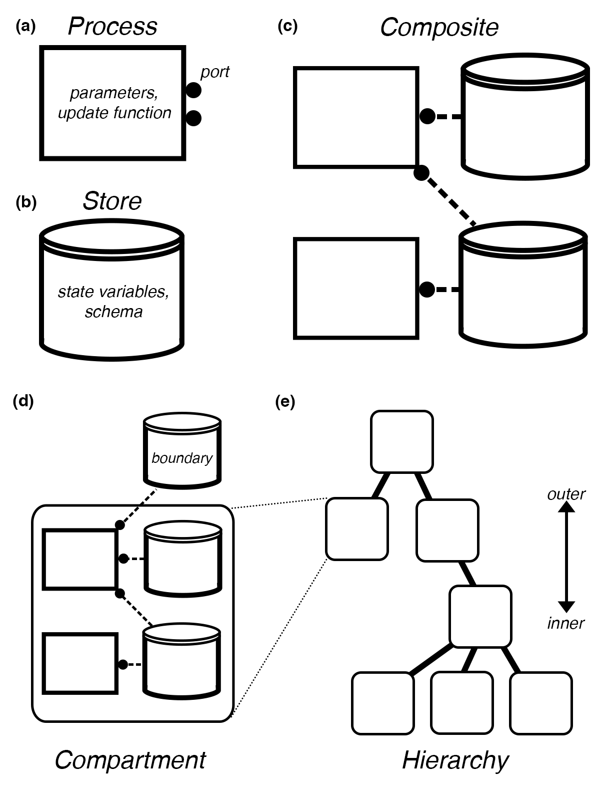

# Vivarium Core

[](https://vivarium-core.readthedocs.io/en/latest/)
[](https://pypi.org/project/vivarium-core/)

Vivarium Core provides a process interface and simulation engine for
composing and executing integrative multi-scale models.

## Concept

Vivarium addresses computational biology's dual challenges of model
reuse and multi-scale integration by explicitly separating the interface
that connects models from the frameworks that implement them.  The
modular "process" interface allows different models to be assembled
within a hierarchy of embedded compartments, and then run by the engine
as integrated, multi-scale simulations.



* (**a**) *Processes* define the functions that update the system's
  state variables.They declare *parameters*, *ports*, and an *update
  function*.
* (**b**) *Stores* hold the state variables and map each process'
  variable *names* to their *values*.  They have a schema that
  determines how the variables are handled with properties such as
  *units*, *updaters*, *dividers*, *emitters*, and more.
* (**c**) *Topology* is a bipartite graph of processes connected to
  stores through their ports.  Shared stores aggregate the processes'
  required variables, and couple the processes as they unfold in time.
* (**d**) Processes and Stores can be linked together with a topology in
  a single level called a compartment, and across compartments by way of
  boundary stores.
* (**e**) Compartments are embedded within each other in a hierarchy --
  depicted here as a place graph with outer compartments at the top and
  inner compartments below them.

## Getting Started

Vivarium Core can be installed as a python library like this:

```console
$ pip install vivarium-core
```

To get started using Vivarium Core, see our
[documentation](https://vivarium-core.readthedocs.io/) and
[tutorial notebook](https://vivarium-core.readthedocs.io/en/latest/tutorials.html).

If you want to contribute to Vivarium Core, see our [contribution
guidelines](CONTRIBUTING.md).

## License

Copyright (C) 2019-2022 The Vivarium Authors

Licensed under the Apache License, Version 2.0 (the "License"); you may
not use this file except in compliance with the License. You may obtain
a copy of the License at http://www.apache.org/licenses/LICENSE-2.0.

Unless required by applicable law or agreed to in writing, software
distributed under the License is distributed on an "AS IS" BASIS,
WITHOUT WARRANTIES OR CONDITIONS OF ANY KIND, either express or implied.
See the License for the specific language governing permissions and
limitations under the License.

See [`LICENSE.txt`](LICENSE.txt) for a copy of the full license, and see
[`AUTHORS.md`](AUTHORS.md) for a list of the Vivarium Authors.
